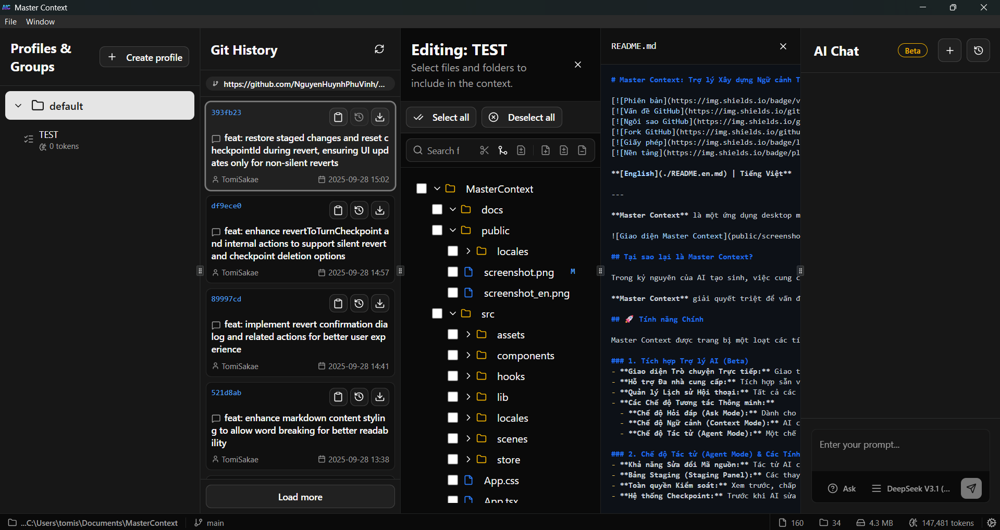

# Master Context: An Intelligent Context-Building Assistant for Developers

[](package.json)
[](LICENSE)
[](https://tauri.app)

**[Tiếng Việt](./README.md) | English**

---

**Master Context** is a powerful desktop application designed to streamline your workflow with Large Language Models (LLMs). Instead of tedious manual copying, the app allows you to intelligently scan, select, and generate organized context files from your project's source code, accelerating development and ensuring high-quality output from your AI.

 <!-- This should be replaced with an actual screenshot of the application -->

## Why Master Context?

In the age of generative AI, providing complete and accurate context about a project is key to receiving quality results. However, manually selecting and copying content from tens, or even hundreds, of files is a time-consuming process prone to errors and omissions.

**Master Context** fundamentally solves this problem by offering a comprehensive and automated toolset, turning context creation from a burden into a strategic advantage.

## Key Features

Master Context comes equipped with a suite of powerful features designed to meet the needs of modern developers.

### 1. Deep Git Integration

- **Visual Commit History:** View the entire commit history of your project directly within the app, with detailed information about authors, dates, and messages.
- **Generate Context/Diff from Commits:** Export the full context of files changed in a commit or just the `.diff` file to review code or ask AI about specific changes.
- **Checkout State:** Revert to the state of any commit to inspect code at a past point in time (Detached HEAD).
- **File Status Display:** The directory tree clearly marks modified files (`M`), newly added (`A`), or deleted (`D`) compared to the latest commit.
- **Clone & Open:** Paste a Git repository URL into the welcome screen to clone and start working immediately.

### 2. Integrated File Viewer & Patcher

- **Quick Content View:** Click on any file to view its content in a separate panel without leaving the application.
- **Apply Diff/Patch:** Paste the content of a patch file (`.diff`, `.patch`) into the app to preview how changes will be applied to the original file.
- **Exclude Source Code:** Easily highlight and exclude unwanted code segments from the context without editing the original file.
- **Save Changes:** After previewing, you can choose to permanently apply the changes from the patch file to the original file on disk.

### 3. Intelligent Project Management & Analysis

- **High-Performance Parallel Scanning**: Leverages the full power of multi-core CPUs to scan and analyze your project at exceptional speeds.
- **Lightning-Fast Rescans (Smart Scan)**: Uses metadata caching (based on modification time and file size) to process only changed files, making subsequent scans nearly instantaneous.
- **Respects `.gitignore`**: Automatically ignores files and directories defined in your project's `.gitignore` file.
- **Custom Exclusion Filters**: Allows you to define glob patterns (e.g., `dist/`, `*.log`, `node_modules/`) to exclude additional unwanted files across the entire project.
- **Skip Content Analysis**: Customize file types (e.g., `.png`, `.lock`, `.svg`) to scan only their metadata without reading their content, significantly speeding up scans for large projects.

### 4. Detailed Context Control

- **Profiles**: Create independent workspaces within the same project. Each profile has its own set of groups, settings, and configurations, ideal for separating different workflows (e.g., "Frontend Tasks," "Backend Refactor," "Database Migration").
- **Context Groups**: Organize files and directories into logical groups for specific tasks. Easily manage, edit, and track these groups.
- **Detailed Statistics**: Each group and the entire project provide visual stats on the total number of files, directories, size, and **estimated token count**, helping you control costs and input for the LLM.
- **Token Budget**: Set a token limit for each group and receive visual warnings when it's exceeded, ensuring your context always stays within the model's limits.

### 5. Dependency Analysis & Automation

- **Source Code Link Analysis**: Automatically analyzes `import`, `export`, and `require` statements to identify dependencies between files.
- **Alias Path Support**: Reads and resolves path aliases from `tsconfig.json` or `jsconfig.json` (e.g., `@/*`, `~/*`), understanding modern project structures.
- **Cross-sync**: When enabled for a group, this feature automatically finds and adds dependent files to the group every time you rescan the project, ensuring your context is always complete.

### 6. Powerful & Flexible Exporting

- **Copy to Clipboard**: Quickly copy the entire context of a group or the whole project to your clipboard with a single click.
- **Directory Tree Options**: Choose to export context with a minimal tree (containing only selected files) or the full project directory tree.
- **Content Customization**:
  - **Add Line Numbers**: Automatically add line numbers to the beginning of each line of code.
  - **Remove Comments**: Minimize token count by automatically stripping comment blocks (`//`, `/* */`, `#`, `<!-- -->`).
  - **Remove Debug Logs**: Automatically remove debugging statements like `console.log`, `dbg!`, `println!`.
  - **Super Compressed Export**: Compresses the entire file content into a single line next to its name in the directory tree—ideal for quick high-level reviews.
- **Exclude Files by Extension**: Easily remove unwanted file types (e.g., `.png`, `.svg`) from the final context file.
- **Always Apply Text**: Define a block of text (e.g., a directive, a question) that will be automatically appended to every exported context file.

### 7. Workflow Optimization

- **Live Watch**: Automatically rescans the project upon detecting changes in the file system, keeping your data always up-to-date.
- **Auto-sync**: Automatically exports the context files for groups and the entire project to a specified directory whenever changes occur, enabling seamless integration with other tools.
- **Recent Projects Management**: Quickly access previously opened projects right from the welcome screen.

### 8. Modern & Flexible User Experience

- **Intuitive Interface**: Built with Shadcn UI and Tailwind CSS, providing a smooth and user-friendly experience.
- **Light/Dark Mode**: Switch the interface to match your work environment.
- **Flexible Panels**: Resizable panels allow you to customize your workspace as you see fit.
- **System Notifications**: Get instant feedback for important actions like a completed scan, successful copy, or errors.

## Tech Stack

- **Frontend**:

  - **Framework**: [React](https://reactjs.org/), [TypeScript](https://www.typescriptlang.org/), [Vite](https://vitejs.dev/)
  - **State Management**: [Zustand](https://github.com/pmndrs/zustand)
  - **UI**: [Shadcn UI](https://ui.shadcn.com/), [Tailwind CSS](https://tailwindcss.com/)
  - **Notifications**: [Tauri Notification Plugin](https://tauri.app/v1/api/js/plugins/notification/)

- **Backend (Rust)**:
  - **Framework**: [Tauri](https://tauri.app/)
  - **File System Scanning**: `ignore`
  - **File Watching**: `notify`
  - **Dependency Parsing**: `regex`
  - **Token Counting**: `tiktoken-rs`
  - **Data Handling**: `serde`, `serde_json`
  - **Project ID Generation**: `sha2`
  - **Git Integration**: `git2`
  - **Time Handling**: `chrono`

## Installation and Setup

### Prerequisites

- [Node.js](https://nodejs.org/)
- [Rust](https://www.rust-lang.org/tools/install) and Cargo

### Steps

1.  **Clone the repository:**

    ```bash
    git clone https://github.com/NguyenHuynhPhuVinh/MasterContext.git
    cd MasterContext
    ```

2.  **Install frontend dependencies:**

    ```bash
    npm install
    ```

3.  **Run the app in development mode:**

    ```bash
    npm run tauri dev
    ```

4.  **Build the application:**
    ```bash
    npm run tauri build
    ```

## License

This project is licensed under the [MIT License](LICENSE).
