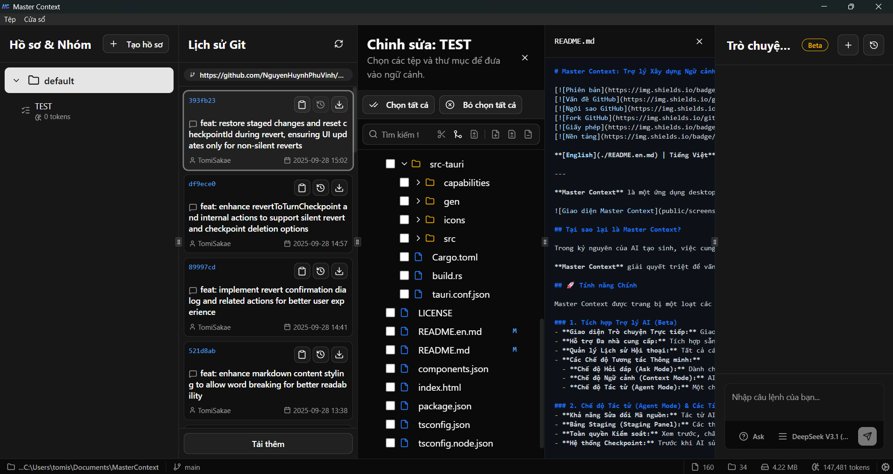

# Master Context: The Intelligent Context-Building Assistant for Developers

[](src-tauri/tauri.conf.json)
[](LICENSE)
[](https://tauri.app)

**Master Context** is a powerful desktop application designed to optimize your workflow with Large Language Models (LLMs). Instead of manual copying, the app allows you to intelligently scan, select, and generate organized context files from your project's source code, accelerating development and ensuring high-quality output from AI.

 <!-- A new screenshot with the multi-panel interface is needed -->

## Why Master Context?

In the era of generative AI, providing complete and accurate context about a project is crucial for receiving quality results. However, manually selecting and copying content from dozens, or even hundreds, of files is a time-consuming process prone to errors and omissions.

**Master Context** thoroughly solves this problem by providing a comprehensive and automated toolset, turning context creation from a burden into a strategic advantage.

## Outstanding Features

Master Context is equipped with a range of powerful features designed to meet the needs of modern developers.

### 1. Deep Git Integration

- **Visual Commit History:** View the entire project commit history directly within the app, with details on author, date, and message.
- **Generate Context/Diff from Commit:** Export the full context of changed files in a commit or just the `.diff` file for code reviews or asking an AI about specific changes.
- **Checkout State:** Revert to the state of any commit to inspect code at a point in the past (Detached HEAD).
- **File Status Display:** The file tree clearly marks files that have been modified (`M`), newly added (`A`), or deleted (`D`) compared to the last commit.
- **Clone & Open:** Paste a Git repository URL on the welcome screen to clone and start working immediately.

### 2. Integrated File Viewer & Patcher

- **Quick Content View:** Click on any file to view its content in a separate panel without leaving the application.
- **Apply Diff/Patch:** Paste the content of a patch file (`.diff`, `.patch`) into the app to preview how the changes would be applied to the original file.
- **Source Code Exclusion:** Easily highlight and exclude unwanted code snippets from the context without modifying the original file.
- **Save Changes:** After previewing, you can choose to permanently apply the changes from the patch file to the original file on disk.

### 3. Intelligent Project Management & Analysis

- **High-Performance Parallel Scanning:** Leveraging the full power of multi-core CPUs, Master Context scans and analyzes your project with exceptional speed.
- **Lightning-Fast Rescan (Smart Scan):** Using metadata caching based on modification time and file size, the app only processes changed files, making rescans almost instantaneous.
- **Respects `.gitignore`:** Automatically ignores files and directories defined in the project's `.gitignore` file.
- **Custom Exclusion Filters:** Allows you to define glob patterns (e.g., `dist/`, `*.log`, `node_modules/`) to further exclude unwanted files across the entire project.
- **Skip Content Analysis:** Customize file types (e.g., `.png`, `.lock`, `.svg`) to scan only metadata without reading content, significantly speeding up scans for large projects.

### 4. Detailed Context Control

- **Profiles:** Create independent workspaces within the same project. Each profile has its own set of groups, settings, and configurations, ideal for separating different workflows (e.g., "Frontend Tasks," "Backend Refactor," "Database Migration").
- **Context Groups:** Organize files and directories into logical groups for specific tasks. Easily manage, edit, and track these groups.
- **Detailed Statistics:** Each group and the entire project have visual statistics on the total number of files, directories, size, and **estimated token count**, helping you control costs and input for the LLM.
- **Token Budget:** Set a token limit for each group and receive visual warnings when it's exceeded, ensuring the context always stays within the model's limits.

### 5. Dependency Analysis & Automation

- **Source Code Link Analysis:** Automatically analyzes `import`, `export`, and `require` statements to identify dependency relationships between files.
- **Alias Path Support:** Reads and resolves alias paths from `tsconfig.json` or `jsconfig.json` (e.g., `@/*`, `~/*`), understanding modern project structures.
- **Cross-sync:** When enabled for a group, this feature automatically finds and adds dependent files to the group every time you rescan the project, ensuring the context is always complete.

### 6. Powerful & Flexible File Export

- **Copy to Clipboard:** Quickly copy the entire context of a group or the whole project to the clipboard with a single click.
- **Directory Tree Options:** Choose to export the context with a minimal directory tree (containing only selected files) or the full project directory tree.
- **Content Customization:**
  - **Add Line Numbers:** Automatically add line numbers to the beginning of each line of code.
  - **Remove Comments:** Minimize token count by automatically removing comment blocks (`//`, `/* */`, `#`, `<!-- -->`).
  - **Remove Debug Logs:** Automatically remove debugging statements like `console.log`, `dbg!`, `println!`.
  - **Super Compressed Export:** Compresses the entire file content into a single line and places it right next to the filename in the directory tree—ideal for quick overviews.
- **Exclude Files by Extension:** Easily remove unwanted file types (e.g., `.png`, `.svg`) from the final context file.
- **Always Apply Text:** Define a piece of text (e.g., an instruction, a question) that will be automatically appended to every exported context file.

### 7. Workflow Optimization

- **Live Watch:** Automatically rescans the project when changes are detected in the file system, keeping your data always up-to-date.
- **Auto-sync:** Automatically exports the context files of groups and the entire project to a specified directory whenever there's a change, seamlessly integrating with other tools.
- **Recent Project Management:** Quickly access previously opened projects right from the welcome screen.

### 8. Modern & Flexible User Experience

- **Intuitive Interface:** Built with Shadcn UI and Tailwind CSS, providing a smooth and user-friendly experience.
- **Light/Dark Mode:** Switch the interface to match your working environment.
- **Flexible Panels:** The multi-panel interface (Project, Git, Editor) is resizable and can be hidden/shown, allowing you to customize your workspace to your liking.
- **System Notifications:** Receive instant feedback for important actions like a completed scan, successful copy, or when an error occurs.

## Technology Stack

- **Frontend**:

  - **Framework**: [React](https://reactjs.org/), [TypeScript](https://www.typescriptlang.org/), [Vite](https://vitejs.dev/)
  - **State Management**: [Zustand](https://github.com/pmndrs/zustand)
  - **UI**: [Shadcn UI](https://ui.shadcn.com/), [Tailwind CSS](https://tailwindcss.com/)
  - **Diffing**: `diff`
  - **Notifications**: [Tauri Notification Plugin](https://tauri.app/v1/api/js/plugins/notification/)

- **Backend (Rust)**:
  - **Framework**: [Tauri](https://tauri.app/)
  - **File System Scanning**: `ignore`
  - **Change Watching**: `notify`
  - **Dependency Analysis**: `regex`
  - **Token Counting**: `tiktoken-rs`
  - **Data Handling**: `serde`, `serde_json`
  - **Project ID Generation**: `sha2`
  - **Git Integration**: `git2`
  - **Time Handling**: `chrono`

## Installation and Running

### Prerequisites

- [Node.js](https://nodejs.org/)
- [Rust](https://www.rust-lang.org/tools/install) and Cargo

### Steps

1.  **Clone the repository:**

    ```bash
    https://github.com/NguyenHuynhPhuVinh/MasterContext.git
    cd MasterContext
    ```

2.  **Install frontend dependencies:**

    ```bash
    npm install
    ```

3.  **Run the application in development mode:**

    ```bash
    npm run tauri dev
    ```

4.  **Build the application:**
    ```bash
    npm run tauri build
    ```

## License

This project is licensed under the [MIT License](LICENSE).
